# Templating in NGINX Instance Manager

## Background

Since the inception of NGINX Instance Manager (NIM), managing NGINX configuration has been a use case of prime importance that F5 has invested development in. To date, capabilities in NIM to edit configuration have required knowledge of NGINX configuration syntax, and direct manipulation of conf files. For users who already have intimate knowledge of this, this may be trivial. However, not all organizations have staff that are experienced and comfortable in doing so. In an enterprise that has multiple personas with a stake in web application or API delivery and security, this may necessitate a different approach to aid usability and confidence in making configuration changes that are intended.

## Announcing Config Templates for NIM

In the 2.16 (April 2024) release, NIM introduced Go templating to simplify creating and standardizing NGINX configurations. These config templates create an abstraction layer for NGINX configuration files, enabling users to provide parameters to generate a working configuration without needing a deep knowledge of NGINX syntax. These templates simplify configuring NGINX, enforce best practices for configurations, and enable self-service permissions for app development.

In this lab we will introduce you to the design on the NIM templating system, as well as walk through using it to apply configuration changes to an NGINX instance as different personae.

> Note: At the time of initial release, NIM ships with a single, general-purpose Base Template. In the future, NGINX aspires to create a vetted set of templates that users can import into NIM for direct consumption, or to be used as a starting point for further customization.

## Simple Configuration & Self-Service through Templates

The templating system for NIM has the following benefits:

### Simplify Configurations

Configurations rendered from templates make administering NGINX extremely easy. Templates can provide only the required parameters via the UI or API.

### Ensure Standards

Maintain consistency and best practices across your NGINX estate by managing crucial settings centrally.

### Empower App Dev Teams

Allow teams to manage and own the contents of their own location or server blocks.

### Maximum Flexibility

Customize existing templates or build your own to suit your needs.

## Config Templates Design

### Types of Templates

Configuration templates come in two types:

- **Base templates**: A base template is a comprehensive set of instructions used to generate a complete NGINX configuration. It includes all the necessary directives and parameters to create a functional NGINX configuration from scratch. Essentially, it’s the foundational configuration on which your NGINX instance operates.

- **Augment templates**: Augment templates are designed to add specific features or modify existing configurations generated by the base template. They include:

  - Feature augments: These add specific functionalities such as caching, authentication, or rate limiting to the NGINX configuration.
  - Segment augments: These modify or add configuration segments like additional server blocks, location directives, or upstream definitions.

### Template resource files

Configuration templates include the following components:

- **Template files (.tmpl)**: Written in Go's templating language, these files define the NGINX configuration's structure and parameters.
  
- **JSON schema files (.json)**: These files create the rules for validating user inputs and generate dynamic web forms for data entry.

- **Auxiliary files**: Additional files required for configuration, such as JavaScript for added functionality, security certificates, or documentation (README.md). These files support the main configuration and provide necessary context or capabilities.

## Target

A target refers to the specific NGINX server instance, instance group, or staged config where a template (base or augment) is intended to be applied. It's the designated location or context within which the generated configuration will be active and operational.

There are three types of targets:

1. **Individual NGINX instance**: Targets a single server, allowing for precise configuration updates or replacements.

2. **Instance group**: A collection of NGINX instances managed as a single group. Applying a template to an instance group ensures uniform configuration across all its servers.

3. **Staged config**: A staging area for configurations before deployment, allowing for testing and validation to minimize potential disruptions upon live deployment.

## Template submission

Template submission involves applying a set of configurations (derived from base and/or augment templates) to a target. This action takes the parameters defined in the templates, generates the final NGINX configuration, and deploys it to the specified target. RBAC plays a pivotal role here, determining who can submit and modify template submissions. Template submission effectively bridges the gap between configuration design and operational use.

Key aspects of template submission include:

- **Snapshots**: Snapshots are created when templates are submitted. Snapshots capture the state of the template and its inputs at the time of submission. This includes all the settings, parameters, and the structure defined in both base and augment templates. By creating a snapshot, NGINX Instance Manager preserves a record of the exact configuration applied to a target at a specific point in time. This is crucial for auditing purposes, rollback scenarios, and understanding the evolution of a server's configuration.

- **Target application**: When submitting a template, it's important to specify the target accurately. The target is the NGINX instance, instance group, or staged config where the generated configuration will be applied. Misidentifying the target can lead to configurations being deployed to unintended environments, potentially causing disruptions.

- **Role-based access control (RBAC)**: With RBAC, administrators can limit who can create and modify template submissions based on team roles or individual responsibilities, ensuring only authorized users can change NGINX configurations.

Ready to get started?

## Templating Lab

### Goal

The goal of this lab is to provide an introduction to the NIM templating system by walking through a few use cases that personas in a typical organization might want to implement. The lab will provide pre-built templates for your use. Authoring templates is out of scope for this lab.

### Overview

The UDF lab consists of:

- A VM with NIM installed
- A VM with KeyCloak to provide single sign-on to NIM using OIDC
- A VM hosting a workload, specifically the [OWASP PyGoat application](https://github.com/adeyosemanputra/pygoat)
- A VM hosting NGINX and Agent, managed by NIM
- A JumpHost VM with a virtual FireFox instance for accessing the web interfaces used in this lab

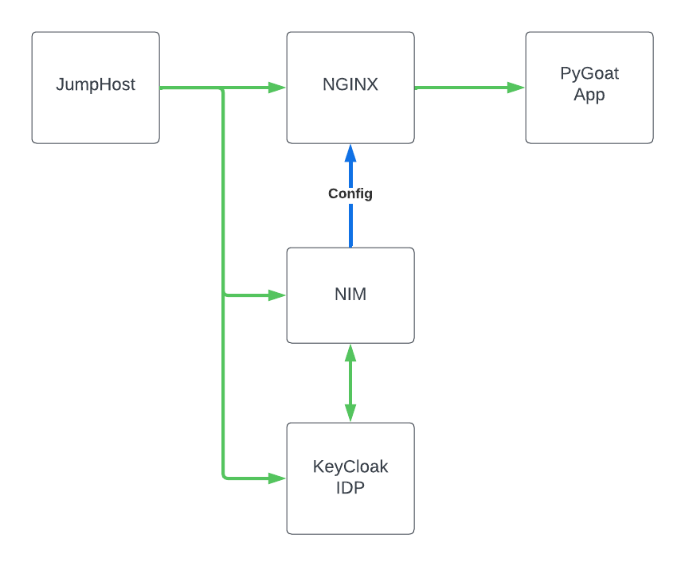

### Login to NIM

In the first portion of the lab you will be masquerading as Paul Platops. Paul is a Platform Operator in charge of the NIM platform. In his organization, NIM is used by developers and security professionals responsible for the delivery and security of their web applications.

Begin by logging into NIM as Paul in the following steps. Paul has the NIM admin role assigned to him.

1. In the UDF deployment, select the **FireFox** access method of the **JumpHost** component.

    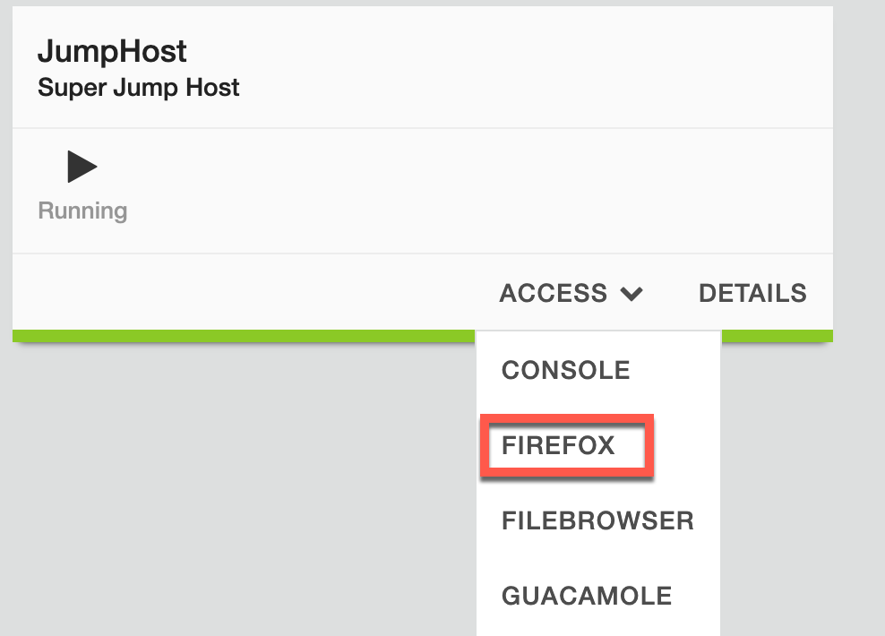

1. Under Lab Links, click the **NIM** link to open NIM in a new tab.

1. Click **Sign In**. You will be redirected to KeyCloak. When prompted for credentials, enter `paulplatops` as the user, `NIM123!@#` as the password.

1. Click the **Instance Manager** tile.

    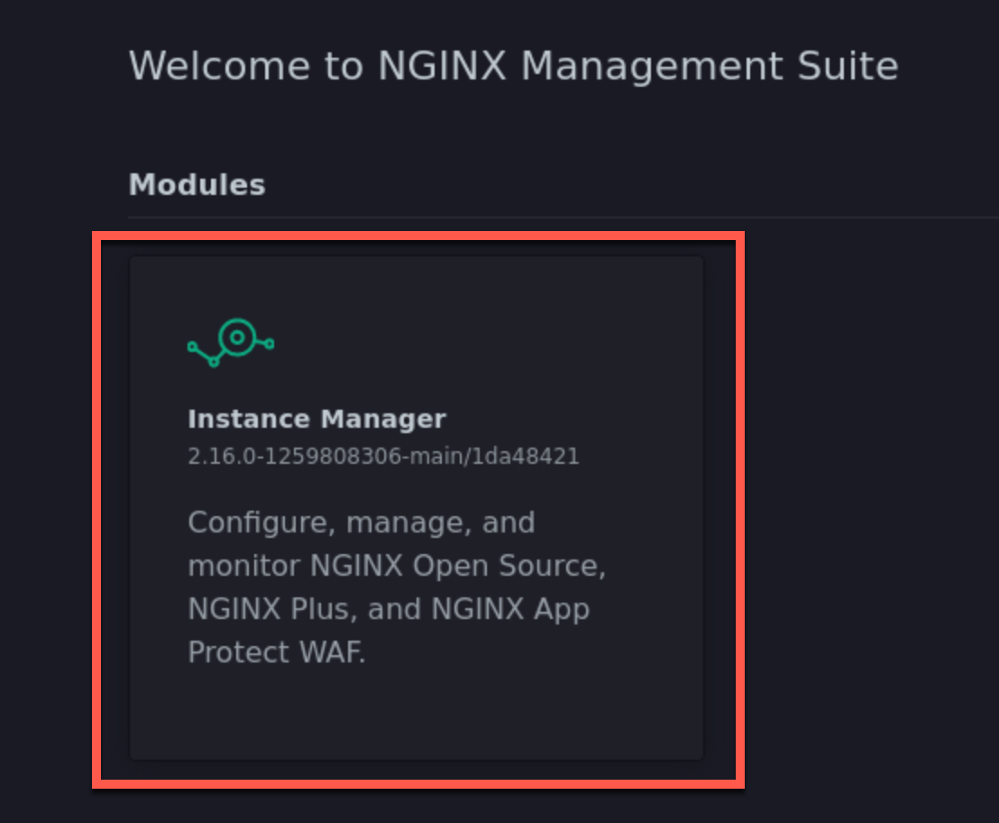

    If you are familiar with NIM, things may seem typical to you, with the addition of **Templates** and **Template Submissions** links in the left navigation:

    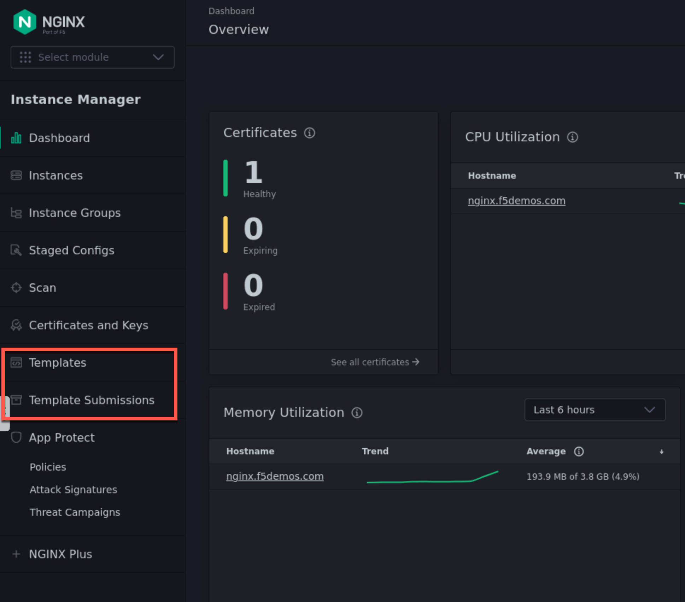

1. Click the **Templates** link. Note there is one base template listed, **F5 Global Default Base**

    > Note: While **F5 Global Default Base** ships with NIM, it does not provide a complete configuration when executed. To accomplish this, we will be installing a custom base template of our own.

### Examine Default NGINX State

In this section, we will examine the default configuration of the NGINX server, and afterward generate a new one for the PyGoat application.

In UDF, click the **Firefox** access method of the **JumpHost** component. This will open a virtual Firefox instance in a browser tab, with a lab links page displaying.

1. Click the **PyGoat Web Application** link. This link uses a hostname record that references the NGINX instance. Since NGINX has not yet been configured to proxy requests to the upstream server hosting the PyGoat application, you will see an "Unable to connect" page. We need to generate configuration that meets our requirements.

### Examine Default Configuration

1. Back in the NIM tab, click the **Instances** link in the left navigation.

    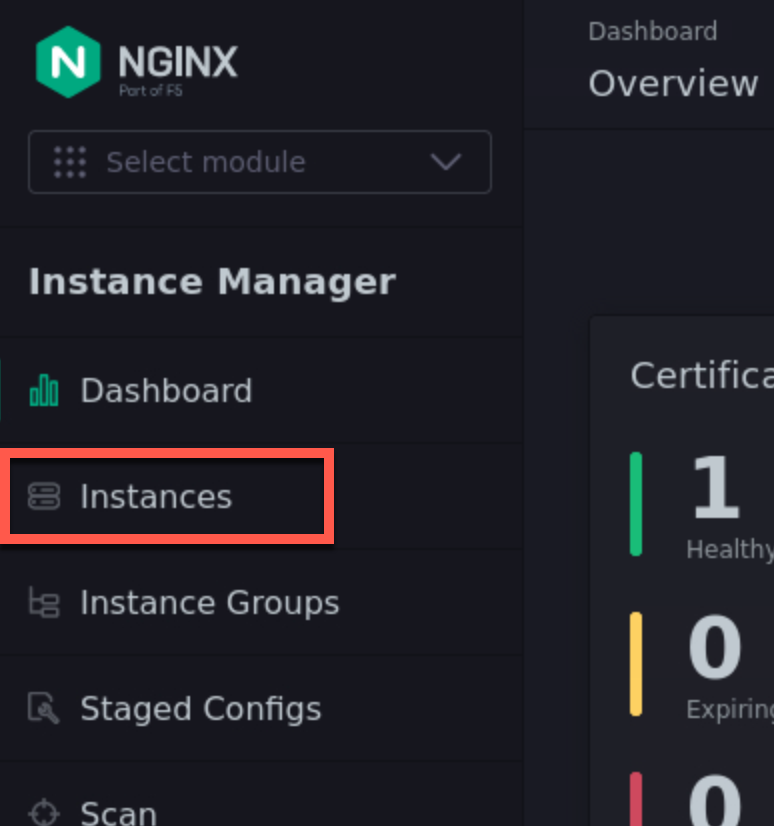

1. Select **nginx.f5demos.com**. Note that it is online, and ready to receive management commands from NIM.

1. Click **Edit Config** near the top right of the window.

You will see the NIM config editor, displaying the existing state of the NGINX configuration files in the instance. As a reminder, the configuration has not been customized for the application we will be hosting in this lab.

### Configure NGINX Using a Template

**Objective:** Install a template, and use it to deploy proxy services for the OWASP PyGoat application.

Paul has been interested in ways to make his job easier and enabling others in his organization to be self-sufficient. To this end, Paul has developed a base template for NIM to deploy proxy services for applications using his organizations preferred configuration practices. Paul is one of a few in his organization that is comfortable with NGINX configuration, so he wants to make it easy for others to be able to deploy their applications on NGINX.

Acting as as Paul, you will first install the base template he developed. Then, you will test this template by actually deploying it to provide an HTTP proxy for the PyGoat application. The PyGoat application has already been installed on the **workloads** server for you.

#### Import a Custom Base Template

1. In the left navigation, click **Templates**.

1. Click the green **+ Create** button in the upper right corner.

    At this point we have the choice to create a new base template from scratch, or to import an existing one. A template bundle has been created for you, so select **Import**.

1. Click **Browse** to browse the JumpHost's file system for the template we wish to import.

1. Select the `basic_reverse_proxy_base.tar.gz` file, and click **Open**.

1. Click the green **Parse** button in the lower right to scan and analyze the contents of this template bundle.

    > Note: You will see a message similar to *"archive is either unsigned or missing its signature file"*. This is a precautionary message, cautioning the user against importing templates that may have originated from an unofficial source. Since this is a custom template, it is not signed by F5.

1. Check the **Allow Signature Bypass** checkbox to override the import dialog.

1. Below the checkbox, you should note that there was one template detected in a bundle, named **Basic Reverse Proxy**. While a template bundle can contain more then one template, we will be importing them one at a time in this lab.

1. Click the **Import** button.

1. You will see the **Config Template Created** message, and see the newly imported base template on the **Templates** page.

    > Note: The newly imported base template will show a **State** of *Draft*. This simply means that the template can be edited in NIM's template editor. As the template author, you can mark a template as **Ready for Use** to prevent it from being unintentionally modified.

#### Deploy NGINX Config Using a Template

1. In the left navigation, click **Templates**.

1. At the left side of the **Basic Reverse Proxy** template there will be a `...` menu in the **Actions** column. Click that, then select **Preview and Generate**. This will present a series of input forms to collect information for the new NGINX HTTP proxy configuration deployment.

1. Select the **Publish to an instance** radio button.

1. In the instance dropdown menu, select **nginx.f5demos.com**. This is an NGINX Plus instance that is already managed by NIM.

1. Click **Next**.

1. In the **Choose Augments** view, click **Next**.

1. On the **HTTP Servers** view, click the **Add HTTP Servers* link. This will reveal a new form to collect server information.

1. Enter the following data in this section:

    | Item                     | Value       |
    |--------------------------|-------------|
    | Server Label             | pygoat      |
    | Listen -> Port           | 443         |
    | Listen -> Default Server | TRUE        |

1. Under **Server name**, click **+ Add item**.

1. Enter the following data:

    | Item                                 | Value              |
    |--------------------------------------|--------------------|
    | Server name -> ITEM 1 -> Server name | pygoat.f5demos.com |

1. In the **TLS Settings** section, enter the following data:

    | Item                     | Value                                         |
    |--------------------------|-----------------------------------------------|
    | Enable TLS               | TRUE                                          |
    | TLS Certificate Path     | /etc/ssl/certs/wildcard.f5demos.com.crt.pem   |
    | TLS Keyfile Path         | /etc/ssl/private/wildcard.f5demos.com.key.pem |
    | Redirect Port            | 80                                            |

1. In the **Server Locations** section, click the **Add Server Locations** link.

1. Enter the following data in this section:

    | Item                     | Value           |
    |--------------------------|-----------------|
    | Location Match Strategy  | Prefix          |
    | URI                      | /               |
    | Upstream Name            | pygoat-upstream |

    > Note: Do not enter any information into the **Proxy Headers** portion of the template form.

    That was a lot of data entry! But what did we just do? Based on the data we entered into the **HTTP Servers** template, we intend to:

    - Create a new HTTP Server called **pygoat.f5demos.com**
    - THis server should listen on port 443
    - Will be the default HTTP server
    - Will encrypt communications using TLS
    - Reference an existing certificate and key for TLS
    - Will redirect any HTTP traffic to HTTPS
    - Create a single location using the `/` path prefix
    - Requests made to this location will pass traffic to an upstream called **pygoat-upstream**
    - No Proxy Headers were configured

    But where is the upstream itself defined?

1. Click **Next**. You will be presented with a form to collect the details of the upstream server for the PyGoat application, which is hosted on the `workloads.f5demos.com` server.

1. In the **HTTP Upstreams** section, click the **Add HTTP Upstream Servers** link.

1. Enter the following data in this section:

    | Item                     | Value           |
    |--------------------------|-----------------|
    | Upstream Name            | pygoat-upstream |
    | Load balancing strategy  | Round Robin     |

1. In the **Servers** section, click **+Add item**.

1. Enter the following data in this section:

    | Item                     | Value                 |
    |--------------------------|-----------------------|
    | Host                     | workloads.f5demos.com |
    | Port                     | 8000                  |
    | Down                     | FALSE                 |
    | Backup                   | FALSE                 |

    > Note: Do not enter any information into the **Zone** portion of the template form.

    What did we configure in the **HTTP Upstreams** portion of the template?

    - An upstream that is configured with a Round Robin loan balancing strategy (unused now, but would be relevant if we had multiple upstream servers configured)
    - A single upstream server, located at `workloads.f5demos.com` on port `8000` was configured
    - This server was not set to **Down**
    - This server was not set as a **Backup** server
    - No Zones were configured

    > Note: the value `pygoat-upstream` was entered into both the **HTTP Servers** and **HTTP Upstreams** templates. Why? This unique identifier needed to match so the templating system could properly correlate these objects together even though they were configured on different pages of the template.

1. Click **Next**. This will show you a preview of the config generated from the templates.

1. Click the filename dropdown (currently displaying `/etc/nginx/nginx.conf`) at the top of the screen. Click `/etc/nginx.mime.types` file. As a convenience, this base template also creates this file for you, and will publish it to the instance in addition to the main `nginx.conf` file.

1. Click the **Publish** button. If successful, you should see a message indicating so.

    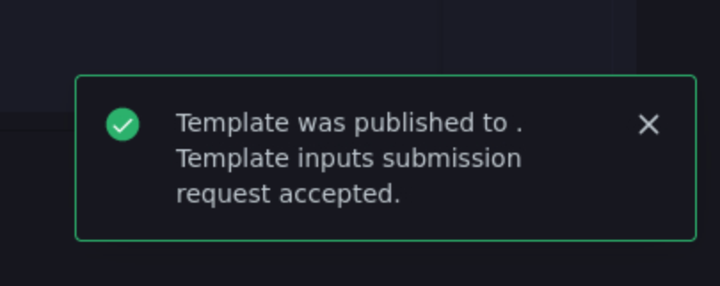

1. Click the **Close and Exit** button.

1. Click **Template Submissions** in the left navigation.

    You should see that the **Basic Reverse Proxy** has been deployed to 1 instance:

    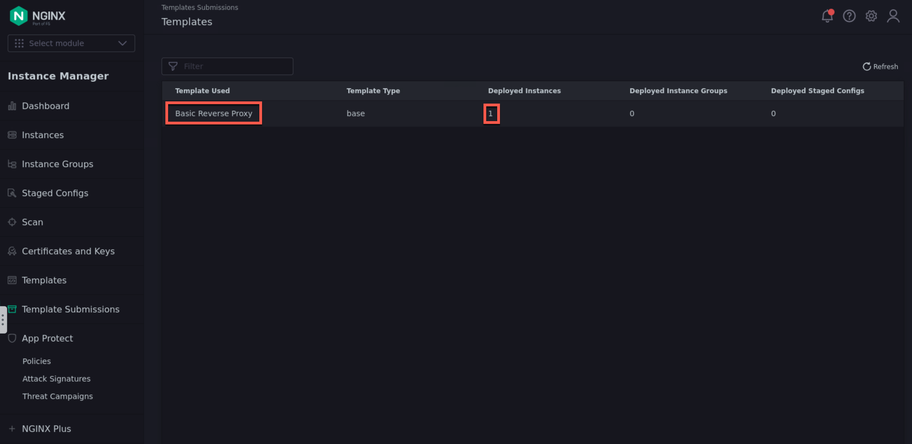

1. Click on the **Basic Reverse Proxy** row. Details of the template submission appear.

1. At the left side of the **nginx.f5demos.com** row, there will be a `...` menu in the **Actions** column. Click that, then select **Edit Submission**.

    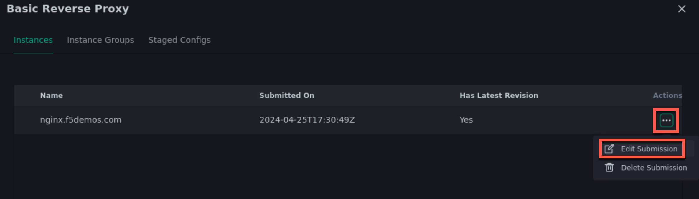

    If we wanted to make changes to the submission, we could simply edit the values here, and publish configuration as we did before.

#### Test the Deployed Configuration

1. Back in the FireFox **Lab Links** tab, click on the **PyGoat Web Application** link once again. The application should load now:

    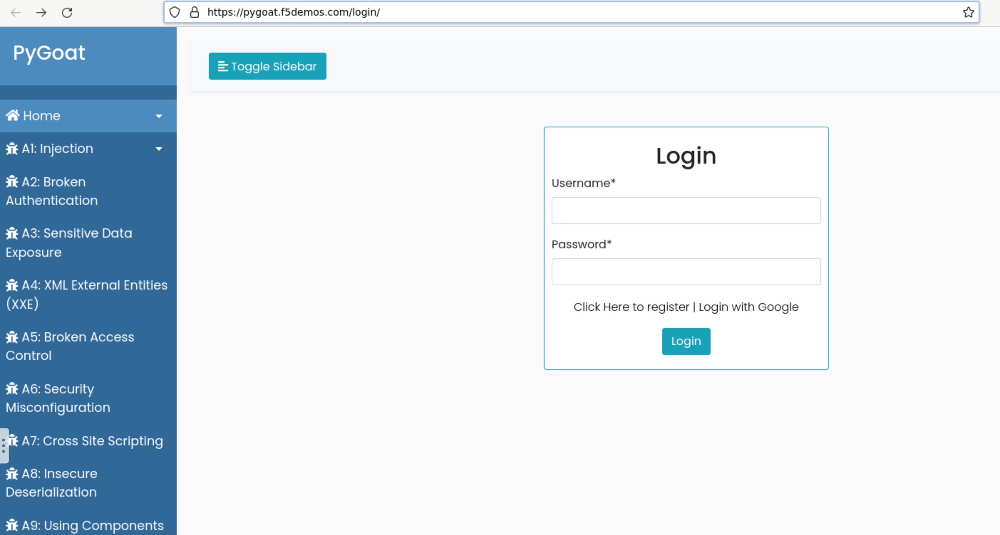

### Provision Access to a Template Submission

Since the initial deployment of the PyGoat application using templates worked well, you (as Paul Platops) would like to extend the editing of this particular configuration to one of the app developers, Jane Developer. Paul would like to only grant Jane access to this template submission, instead of the whole template. He wants to allow Jane to ***only*** be able to make changes to the values used in the templated configuration for the specific NGINX instance that was targeted in the template submission. He does not want Jane to be able to use templates to target other NGINX instances in their data center. How will he accomplish this?

#### Use RBAC to Grant Access to the Template Submission

1. In NIM, click the top left module menu, and select **Settings**.

1. Click **Users**. Note that Jane Developer already has an account, and that her account is mapped to the **developer** role.

1. Click **Roles**. Note that the developer role is listed, and already has some permissions associated with it.

1. Click the **developer** row to list additional details. Note at present developers only have READ access to the configuration of the nginx.f5demos.com system, which isn't very useful. Let's grant a couple more permissions to make NIM more useful for the developers.

1. Click the **Edit Role** button, then click **Add Permission**.

1. Select **Instance Manager** for the *Module*.

1. Select **Analytics** for the *Feature*.

    Note that *Access* is already preset to **READ**, which is sufficient.

1. Click **Save**. **Permission Update Staged** will be displayed. Once applied, this will permit the developers to have access to the analytics data on the NIM dashboard.

    At this point, the staged permissions look like this:

    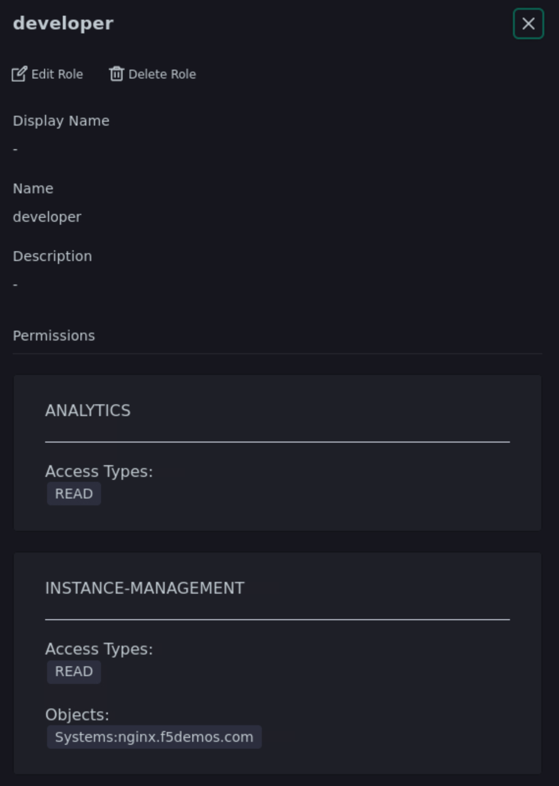

    Next we will add the ability for the developer role to update the Template Submission object of the NGINX instance that proxies the PyGoat application.

1. Click **Add Permission**.

1. Select **Instance Manager** for the *Module*.

1. Select **Template Submissions** for the *Feature*.

1. Click **Add Additional Access**.

1. Select **Create**, **Read** and **Update** for *Access*.

1. Select **Systems** for *Applies to**.

1. Select **nginx.f5demos.com** for the system selection to the right.

    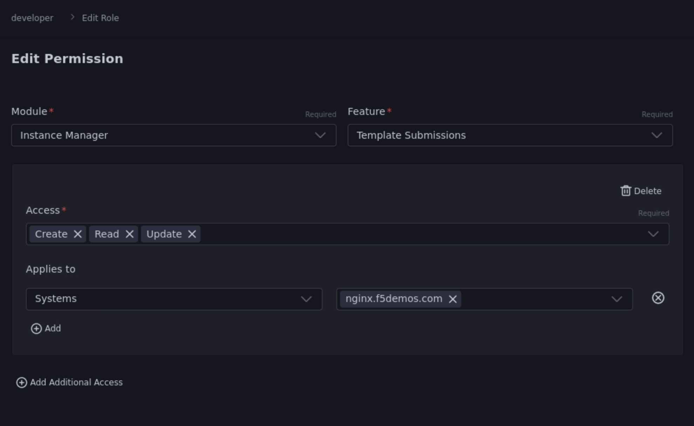

1. Click **Save**. You will see a **Permission Update Staged** message.

1. Click **Save** once again to save the staged role changes. You will see a **Role Updated** message indicating success.

1. Close the developer role details by clicking the **x** button in the top right of the dialog.

### Login to NIM as Jane Developer

We are now going to log in as Jane Developer so that we can verify she has access to update the template submission.

1. Click the person icon in the top right corner, then click the **Logout** link.

    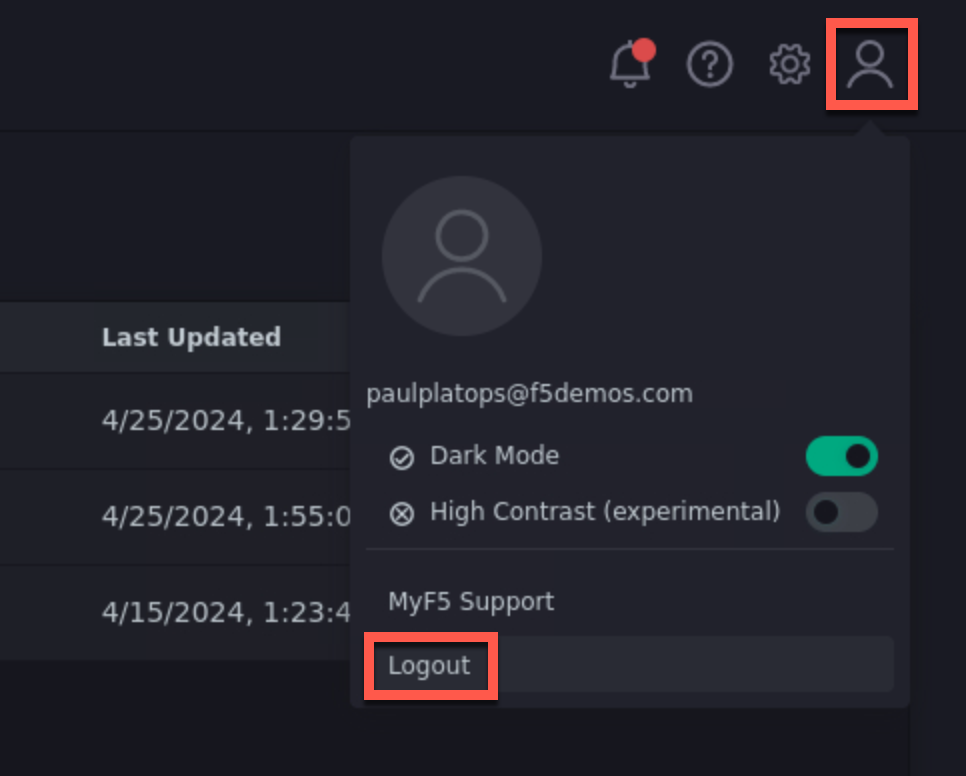

1. Click **Sign In**. You will be redirected to KeyCloak. When prompted for credentials, enter `janedev` as the user, `NIM123!@#` as the password.

1. Click the **Instance Manager** tile.

1. You are presented with the Overview Dashboard showing the metrics of the **nginx.f5demos.com** instance. Jane is able to see this because we added access to do so via the developer role.

    > Note: The Certificates panel is not loading any data. Why? If you hover over the red diamond icon, you will see that access has been denied. Access to view certificate data has not been granted to the developer role. This is not something we will address at this time, but you are welcome to come back to this after completing the lab to resolve this issue.

    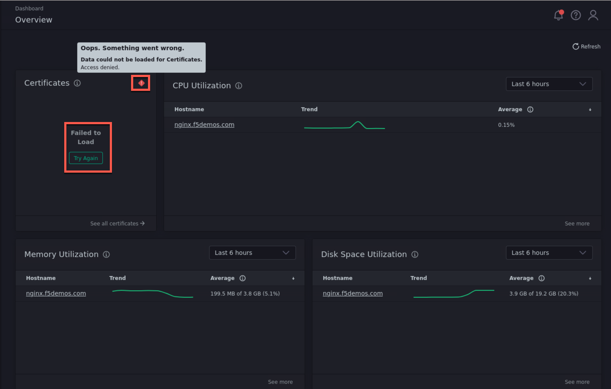

### Update Template Submission as Jane Developer

1. Click **Template Submissions** in the left navigation.

    Notice the **Templates** menu item does not appear, as we have not granted the developer role access to the Templates themselves.

1. Click on the **Basic Reverse Proxy** row. Details of the template submission appear.

1. At the left side of the **nginx.f5demos.com** row, there will be a `...` menu in the **Actions** column. Click that, then select **Edit Submission**.

    You should see the familiar template filled with values similar to what you saw earlier.

1. On the **HTTP Servers** view, click the edit icon on the **pygoat** row.

1. Change the *HTTP Server Inputs -> Listen -> Default Server* value to **FALSE**.

1. Click the **Next** button until you see the preview of the config generated from the templates. Note the diff view shows that the `default_server` is being removed from the listen directive.

1. Click the **Publish** button. If successful, you should see a message indicating so.

1. On the PyGoat FireFox tab, refresh the browser to ensure the application is still working.

You did it! What if Jane would like to control aspects of the configuration that have not been exposed in the base template? As you read about in the lab introduction, this this is where Augment Templates can be used.

### Import a Custom 404 Augment Template

We are now going to log in as Paul Platops so that we can import and grant developers access to an Augment Template that attaches a custom pre-built 404 response handler.

1. Click the person icon in the top right corner, then click the **Logout** link.

1. Click **Sign In**. You will be redirected to KeyCloak. When prompted for credentials, enter `paulplatops` as the user, `NIM123!@#` as the password.

1. Click the **Instance Manager** tile.

1. In the left navigation, click **Templates**.

1. Click the green **+ Create** button in the upper right corner.

    At this point we have the choice to create a new augment template from scratch, or to import an existing one. An augment template bundle has been created for you, so select **Import**.

1. Click **Browse** to browse the JumpHost's file system for the template we wish to import.

1. Select the `custom_404_augment.tar.gz` file, and click **Open**.

    This augment template was designed to be used with the base template we used earlier in the lab. It adds the capability to intercept 404 responses from the upstream, and respond with a custom html page. Yes, the custom response page has cats. This is fine.

1. Click the green **Parse** button in the lower right to scan and analyze the contents of this template bundle.

1. As you did earlier in the lab, check the **Allow Signature Bypass** checkbox to override the import dialog.

1. Below the checkbox, you should note that there was one template detected in a bundle, named **Custom 404 Response**.

1. Click the **Import** button.

1. You will see the **Config Template Created** message, and see the newly imported augment template on the **Templates** page.

  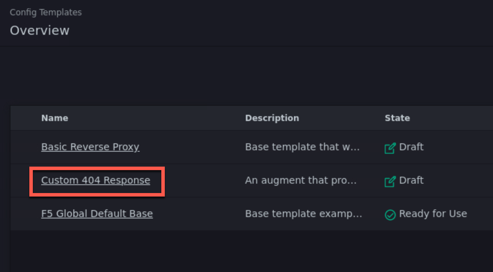

### Apply the Custom 404 Augment Template

As Jane Developer, we will attach the custom 404 handler to the NGINX configuration that she has been granted access to. We (as Jane Developer) will use the augment template that Paul just imported to accomplish this.

1. Click the person icon in the top right corner, then click the **Logout** link.

1. Click **Sign In**. You will be redirected to KeyCloak. When prompted for credentials, enter `janedev` as the user, `NIM123!@#` as the password.

1. Click the **Instance Manager** tile.

1. Click **Template Submissions** in the left navigation.

1. Click on the **Basic Reverse Proxy** row. Details of the template submission appear.

1. At the left side of the **nginx.f5demos.com** row, there will be a `...` menu in the **Actions** column. Click that, then select **Edit Submission**.

    You should see the familiar template filled with values similar to what you saw earlier.

1. Click **Next** to transition to the **Choose Augments** view. Note the augment template Paul Platops imported earlier is ready for use.

    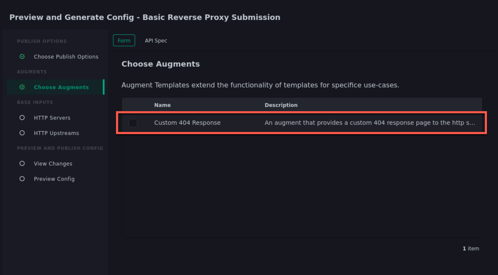

1. Click the checkbox on the **Custom 404 Response** row. When you do, the template form builder will add a new step indicating there is an additional step needed to capture inputs for this new augment template.

    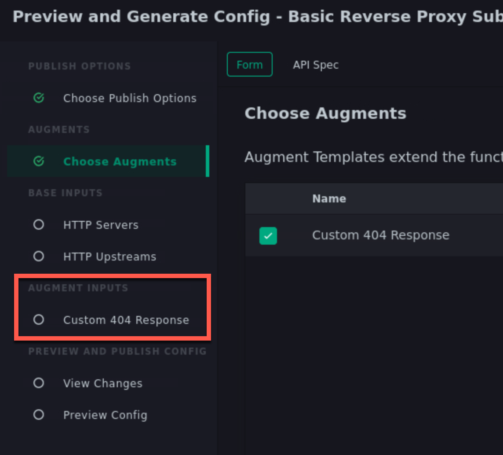

1. Click the **Next** button until you reach the **Custom 404 Response** input step.

    This step only has one option - to enable it or not.

1. Choose **TRUE** in the *Use Custom 404 Response* input.

    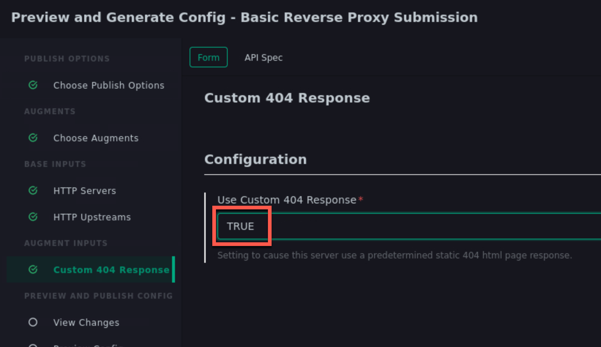

1. Click **Next**. You will be presented with the diff view showing the changes that would happen to the nginx.conf file if the changes were to be published.

    It is important to understand that Augment templates are applied to configuration files within `include` directives. To see the details of what the augment template adds, click the file selector dropdown at the top of the editor.

    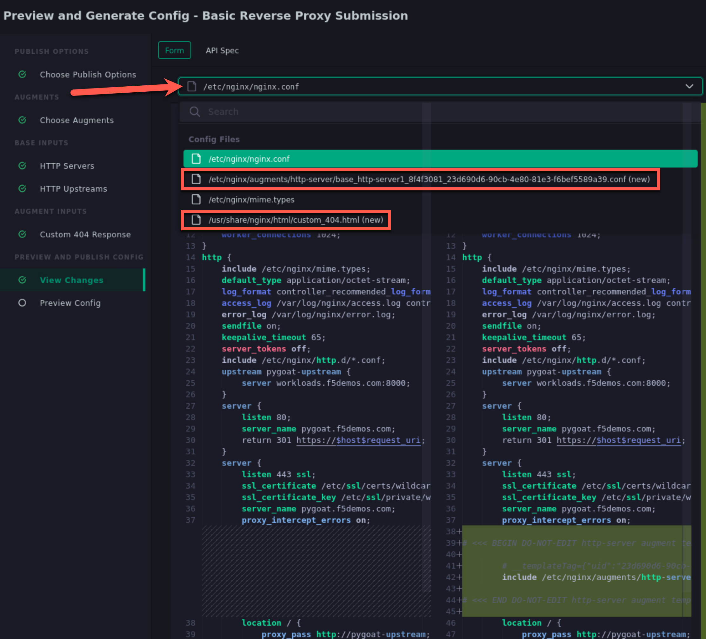

    Notice there are 2 new files in the generated configuration:

      - /etc/nginx/augments/http-server/base_http-server1_*&lt;unique identifier&gt;*.conf
      - /usr/share/nginx/html/custom_404.html

1. Click on the first file. This is the file that will be included in the main `nginx.conf` file. It contains the config to intercept 404 errors from the upstream, and will serve up the contents of a static file included in the template bundle.

1. Click on the second file. This is the static HTML page that will be displayed by the configuration in the previous file.

1. Click the **Publish** button. If successful, you should see a message indicating so.

### Test the Augment Template

1. In FireFox, click the tab for the PyGoat app.

1. Modify the URL to a reference a page that does not exist, such as: `https://pygoat.f5demos.com/login/non-existent-page.html` and hit enter.

1. You will see the custom 404 page. You were previously warned there would be cats.

    

### Import another Augment Template

We are now going to log in as Paul Platops so that we can import and grant persons in the **secops** role access to rate limiting augment template.

1. Click the person icon in the top right corner, then click the **Logout** link.

1. Click **Sign In**. You will be redirected to KeyCloak. When prompted for credentials, enter `paulplatops` as the user, `NIM123!@#` as the password.

1. Click the **Instance Manager** tile.

1. In the left navigation, click **Templates**.

1. Click the green **+ Create** button in the upper right corner.

1. Select **Import**.

1. Click **Browse** to browse the JumpHost's file system for the template we wish to import.

1. Select the `rate_limit_augment.tar.gz` file, and click **Open**.

    This augment template was designed to be used with the base template we used earlier in the lab. It adds the capability to attach a rate limiting policy to an HTTP Server.

1. Click the green **Parse** button in the lower right to scan and analyze the contents of this template bundle.

1. As you did earlier in the lab, check the **Allow Signature Bypass** checkbox to override the import dialog.

1. Below the checkbox, you should note that there was one template detected in a bundle, named **Rate Limiting**.

1. Click the **Import** button.

1. You will see the **Config Template Created** message, and see the newly imported augment template on the **Templates** page.

    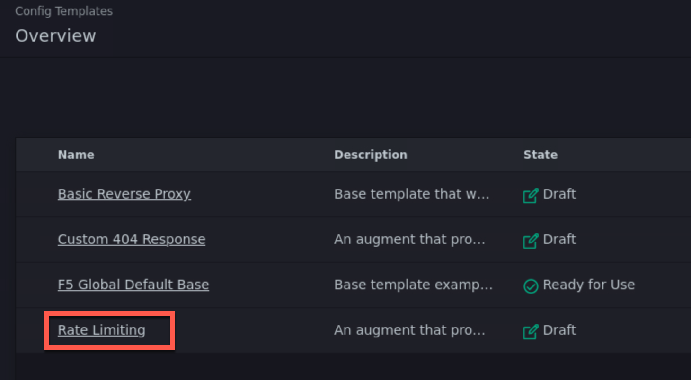

### Apply the Rate Limiting Augment Template

Sally Secops has noticed that the PyGoat application's login API has been overused by actors with questionable intent, also resulting in degraded application performance. Sally would like to attach rate limiting to the NGINX configuration or the PyGoat application's NGINX HTTP Server. We (as Sally Secops) will use the augment template that Paul just imported to accomplish this.

1. Click the person icon in the top right corner, then click the **Logout** link.

1. Click **Sign In**. You will be redirected to KeyCloak. When prompted for credentials, enter `sallysecops` as the user, `NIM123!@#` as the password.

1. Click the **Instance Manager** tile.

1. Click **Template Submissions** in the left navigation.

1. Click on the **Basic Reverse Proxy** row. Details of the template submission appear.

1. At the left side of the **nginx.f5demos.com** row, there will be a `...` menu in the **Actions** column. Click that, then select **Edit Submission**.

    You should see the familiar template filled with values similar to what you saw earlier.

1. Click **Next** to transition to the **Choose Augments** view. Note the **Custom 404 Response** augment template that Jane used on this template submission is still selected. Select the checkbox next to **Rate Limiting**.

    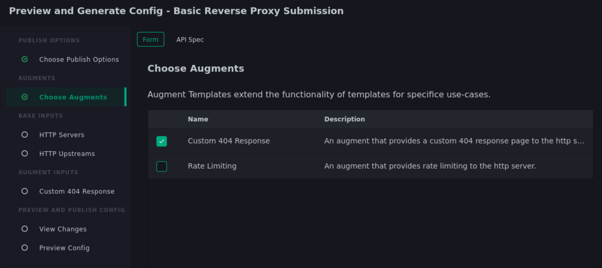

1. Click the checkbox on the **Custom 404 Response** row. When you do, the template form builder will add a new step indicating there is an additional step needed to capture inputs for this new augment template.

    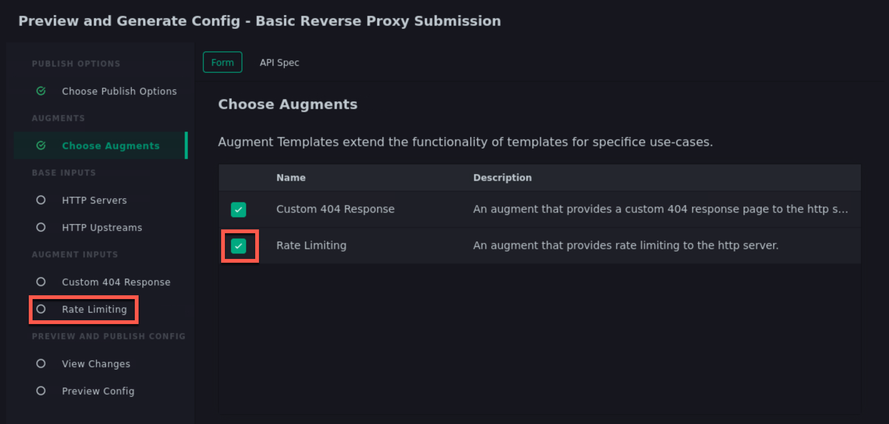

1. Click the **Next** button until you reach the **Rate Limiting** input step.

    This step has 3 options. Enter the values from the following table:

    | Item                | Value                 |
    |---------------------|-----------------------|
    | Apply Rate Limiting | TRUE                  |
    | Rate Limit Method   | Binary Remote Address |
    | Requests Per Second | 5                     |

    > Note: Realistically, 5 requests per second per client is extremely low. We are just using this value for illustrative purposes.

    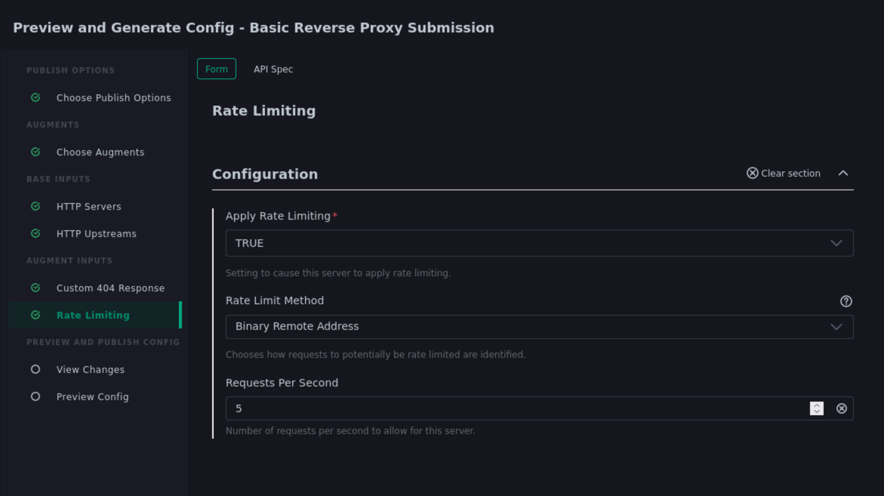

1. Click **Next**. You will be presented with the diff view showing the changes that would happen to the nginx.conf file if the changes were to be published.

    Notice that there are two changes in the diff editor: one in the http context, and one in the server context. Since the Rate Limiting template needs to insert directives into both contexts, this template emits two different include statements as pictured below.

    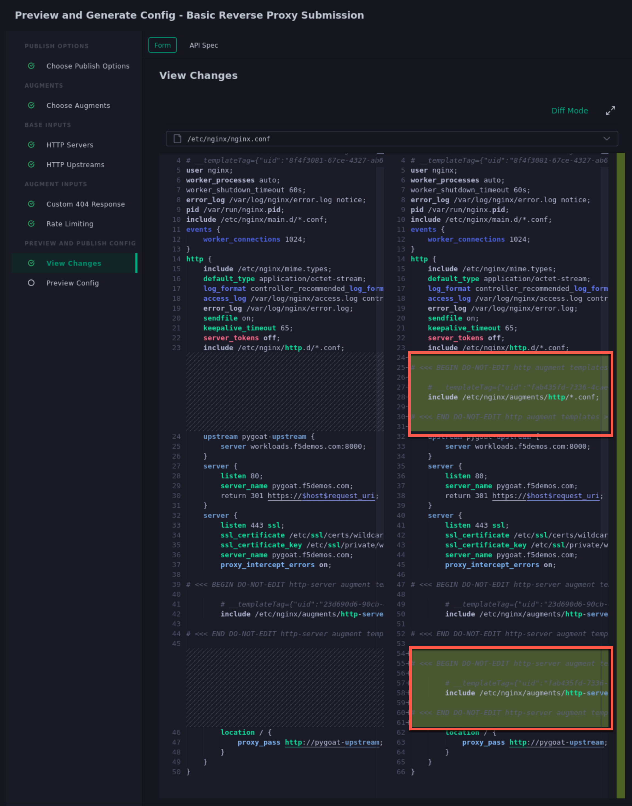

    In addition to the changes to `nginx.conf`, there are 2 new files in the generated configuration:

      - /etc/nginx/augments/http-server/base_http-server1_*&lt;unique identifier&gt;*.conf
      - /etc/nginx/augments/http/*&lt;unique identifier&gt;*.conf

1. Click on each of these new files. They are files that will be included in the main `nginx.conf` file at the `http` and `server` contexts.

    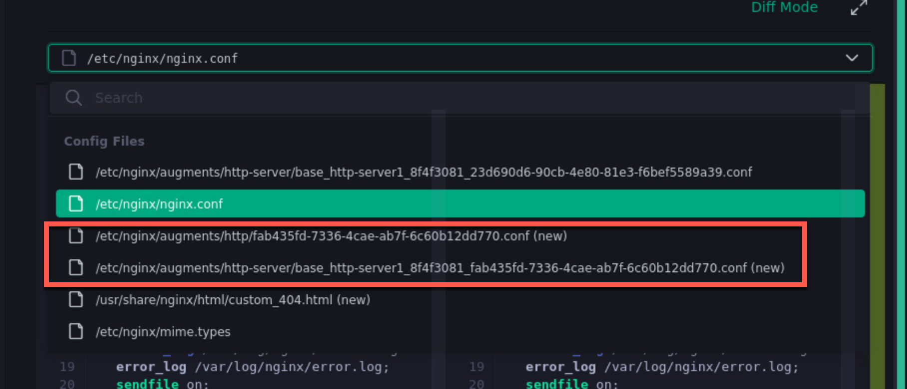

1. Click the **Publish** button. If successful, you should see a message indicating so.

### Test the Rate Limiting Augment Template

In this final section of the lab, we will use the hey utility to test the efficacy of the rate limiting augment template that you just deployed.

1. In the UDF deployment, select the **Web Shell** access method of the **JumpHost** component.

1. In the Web Shell, run the following:

    ```shell
    hey -n 10 -c 1 -q 2 https://pygoat.f5demos.com/login/
    ```

    This will execute a total of `10` requests using `1` concurrent worker at a rate of `2` requests per second against the `https://pygoat.f5demos.com/login/` URL. You should see output similar to the following:

    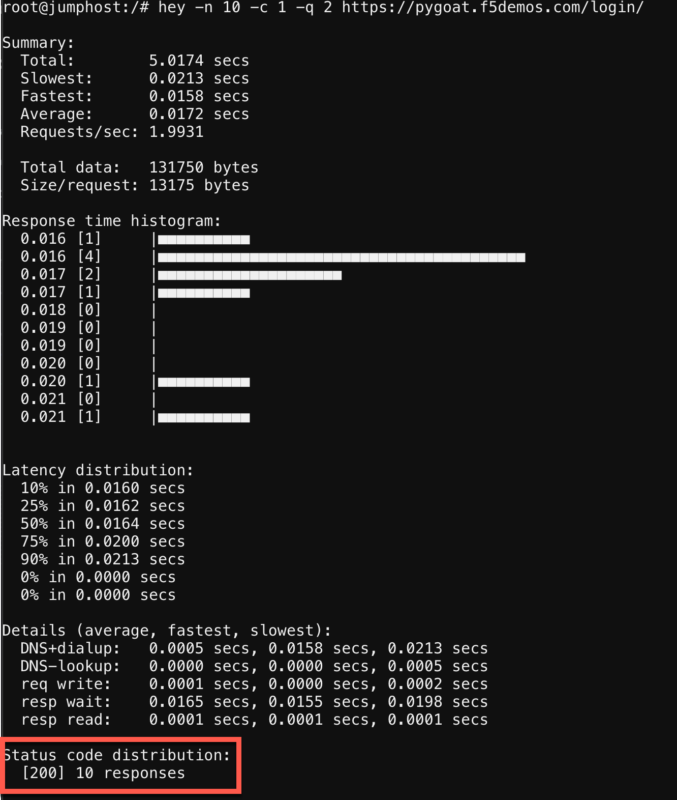

    Notice that all 10 requests were successful with a status code of 200 observed. Let's try increasing the rate to see what happens...

1. In the Web Shell, run the following:

    ```shell
    hey -n 10 -c 1 -q 6 https://pygoat.f5demos.com/login/
    ```

    This will execute a total of `10` requests using `1` concurrent worker at a rate of `6` requests per second against the `https://pygoat.f5demos.com/login/` URL. If you recall, this rate is above the rate limiting threshold you set in the augment template. You should see output similar to the following:

    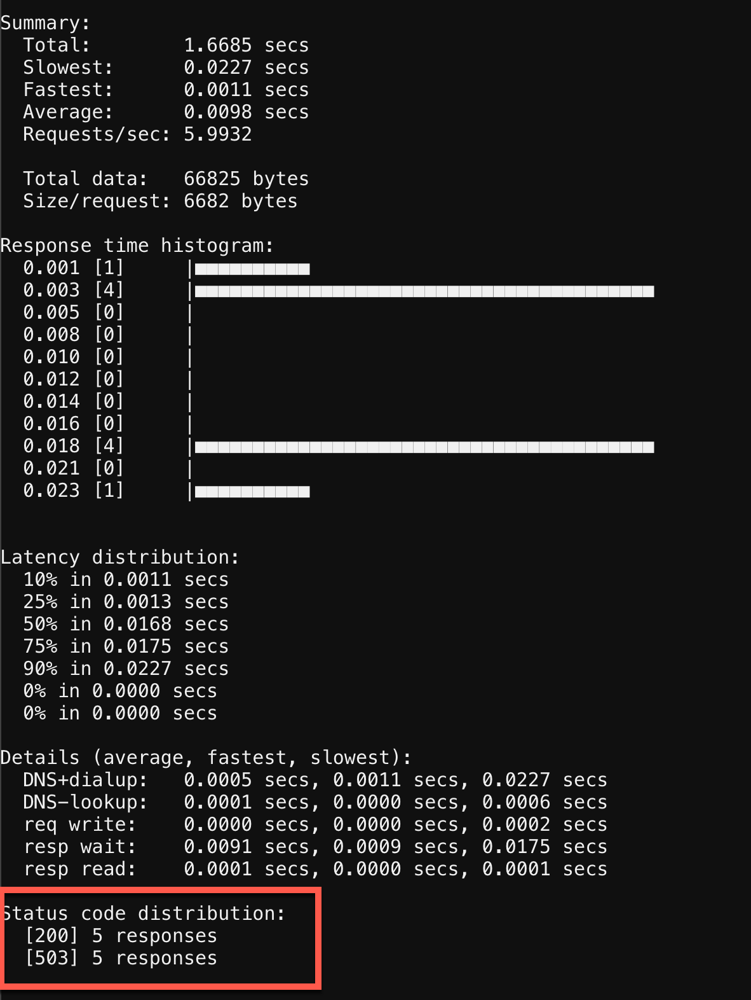

    Notice that the first requests were successful with a status code of 200 observed. Then, `hey` started to receive status code 503 (Service Unavailable), indicating that this client has been rate limited for exceeding the threshold you set.

### Conclusion

As you have witnessed, NIM's Templating framework gives organizations the control they need to empower users of their NGINX platform. Via templates, these users can apply use cases to their application delivery tier without requiring they be NGINX configuration experts. Additionally, the framework allows organizations to provide this capability to users in a "least-privileged" manner - only granting them permissions to execute templates on the instances they have been assigned. This ensures compliance, and significantly narrows the "blast radius" in the event an outage occurs due to human error while configuring.
